# **Future Price Prediction of different commodities of different APMCs (Time Series Problem)**

## **Objective**:  
- To understand trends in APMC(Agricultural Produce Market Committee)/Mandi prices for different commodities in Maharashtra.
- To predict the future trends of price for different commodities.

## **Data Description**
**Total unique commodities**: 204  
**Total unique APMCs**: 349

## **Some of the top APMCs & Commodities**  

| Top APMCs|Top Commodities |
|----------|----------------|
|Mumbai|Gram|
|Pune|Wheat(Husked)|
|Nagpur|Soybean|
|Barshi|Sorgum(Jawar)|
|Jalgaon|Pigeon Pea (Tur)|
|Solapur|Maize|
|Kamthi|Green Gram|

## **Plotting `modal_price`vs `date`**
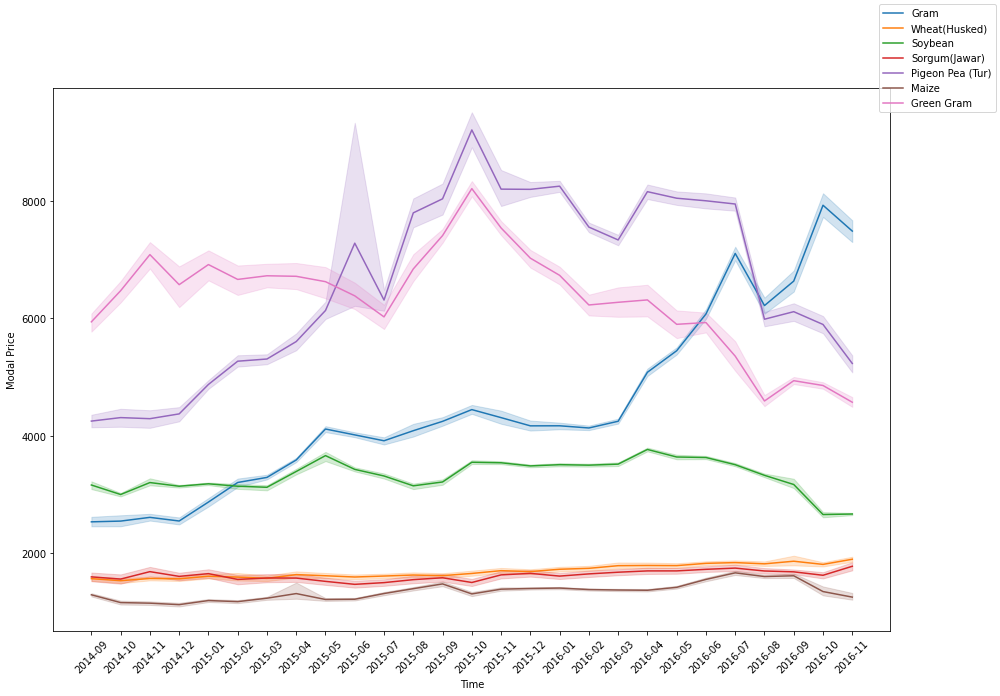

## **Removing the outliers**
To remove outliers, we use IQR range to filter out those values that fall out of the
range. We do this with our function `IQR`.

```python
def IQR(df):
  Q1 = df["modal_price"].quantile(0.25)
  Q3 = df["modal_price"].quantile(0.75)
  IQR = Q3 - Q1
  lower_limit = Q1 - IQR*1.5
  upper_limit = Q3 + IQR*1.5
  to_delete = ( (df["modal_price"] < lower_limit) | (df["modal_price"] > upper_limit) )
  return to_delete
```
> Total original data points: **62429**  
> Data points after outlier removal: **59144**  
> Total outliers removed: **3285**

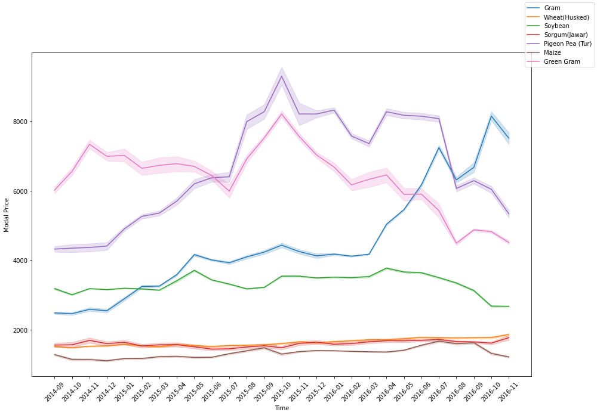  

We can see now the bands have become thin, which means the prices are now
more consistent and close to one another.

## **Using SARIMAX model for fitting, predicting and forecasting.**
The SARIMAX model has 3 hyperparameters: **p, d, q**. We first implement the model with guess values of (p,d,q) on one of the clusters to see goodness of fit.

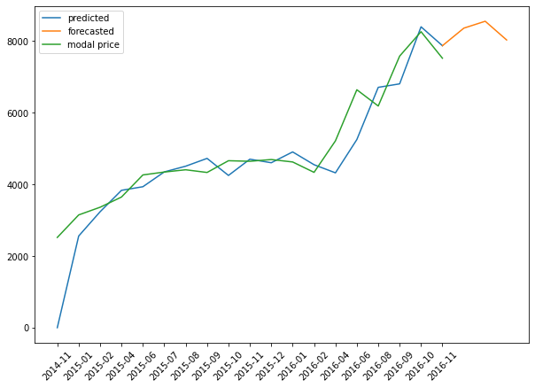

## **Hyperparameters Optimization using Grid Search**
### **Hyperparameters: (p, d, q)**  
### **Performance metric: RMSE**
We iterate over the values of p, d, q and find the best-fit value of (p,d,q) that
obtains the least amount of RMSE.

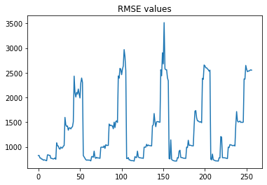
> Minimum RMSE: **711.95**  
> Best order(p, d, q): **(3, 1, 12)**

### **Plotting prediction & forecasting with best-fit order**
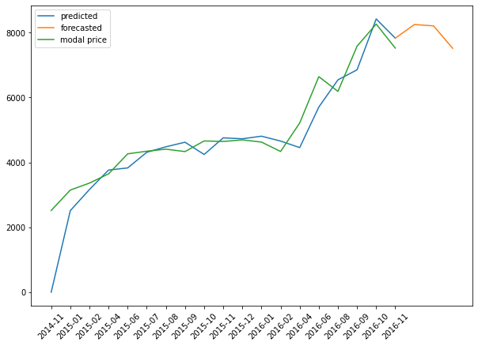

### **The model(including grid search) is now complete and can be applied on all clusters of APMC-Commodity !**

## **Results**
Here are some of the final best-fit predictions for the clusters.

|||
|----------------------------------|-------------------------------------|
|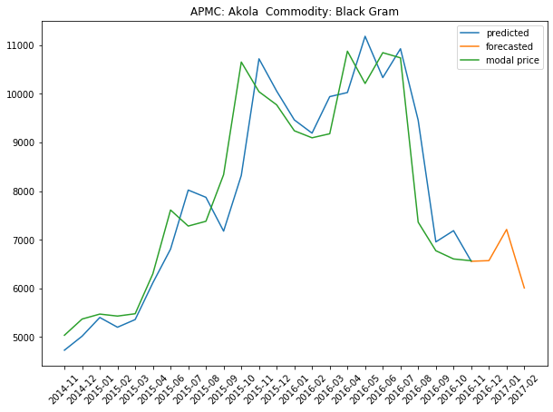|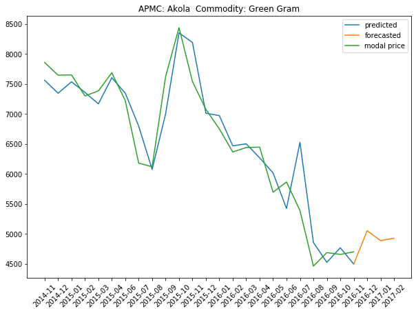|
|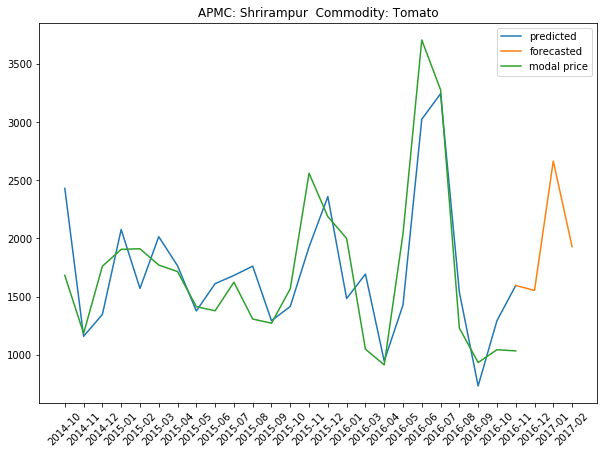|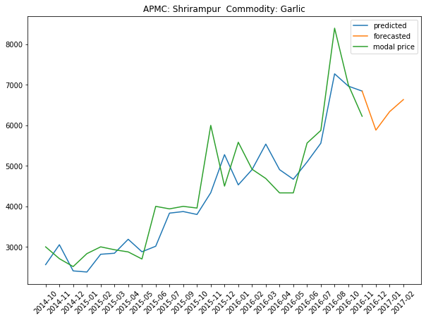|
|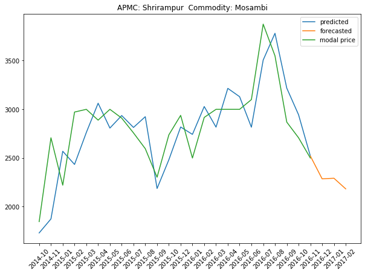|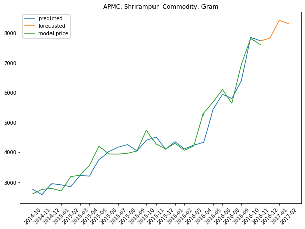|
|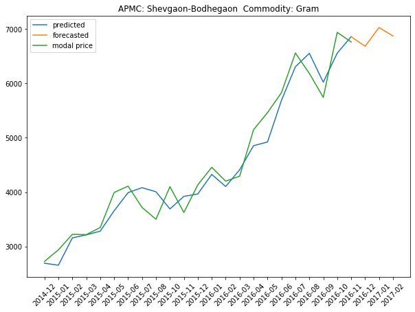|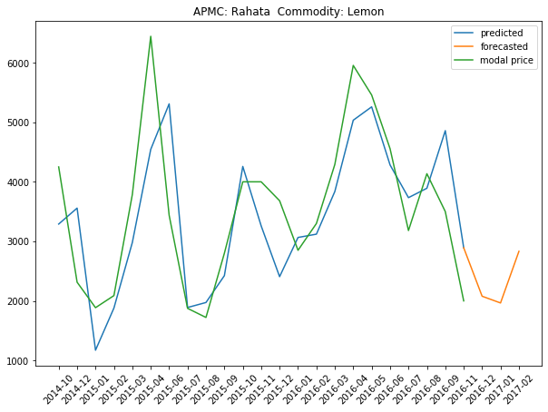|
|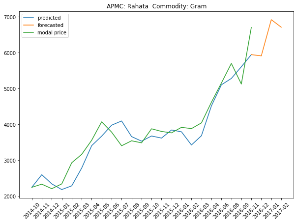|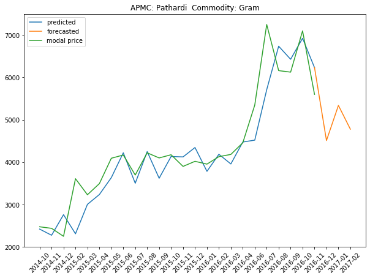|
|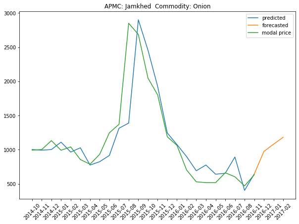|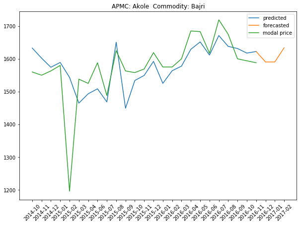|


This project was jointly done by the following team members:  

  

